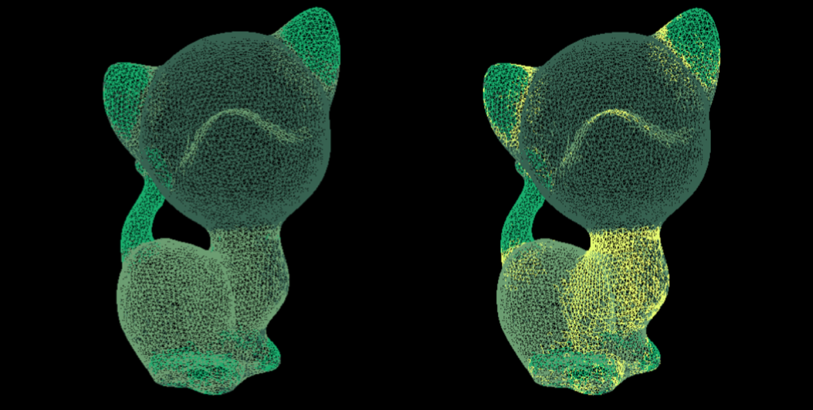

# shape segmentation
Implements the Shape Diameter Function by Shapira et al. to partition closed and intersection free meshes in a largely pose oblivious manner.

Note: Assumes Eigen 3.2.4 is in /usr/local/Cellar/eigen/3.2.4/include/eigen3/
